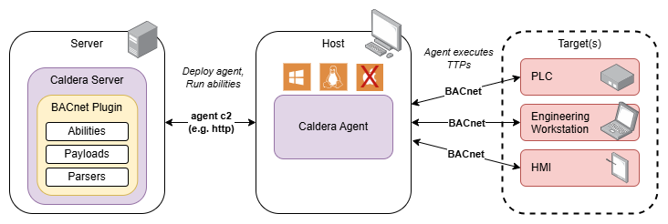

# BACnet

BACnet (Building and Control Network) Protocol Threat Emulation Tooling

v1.1 released 19 Nov 2024  
Mapped to MITRE ATT&CK® for ICS [v16](https://attack.mitre.org/resources/updates/updates-october-2024/)

## Overview
The BACnet plugin provides **14** adversary emulation abilities specific to the BACnet protocol. The BACnet standard, ANSI/ASHRAE 135, for the BACnet protocol is available for purchase from ASHRAE as described on the [BACnet Committee](https://bacnet.org/buy/) website.

The following table outlines MITRE ATT&CK for ICS Tactic coverage provided by the BACnet plugin:

| Discovery                           | Collection                 | Impact  | Inhibit Response Function |
| :----------------------             | :------------------------- | :---------------------- | :----------------------   |
| Remote System Discovery             | Automated Collection       | Manipulation of Control | Device Restart/Shutdown   |  
| Remote System Information Discovery | Monitor Process State      |                         |                           |
|                                     | Point & Tag Identification |                         |                           |

### Compatibility
The plugin's payloads currently support deployment to Caldera Agents of the following computer architectures:
|        | Windows | Linux | Macintosh |
| -----: | :-----: | :---: | :-------: |
| 32-bit |         |       |           |
| 64-bit | **X**   | **X** |           |

* The linux payload was compiled on Ubuntu 22.04.2 LTS with GNU Make 4.4.
* The windows payload was compiled on Windows 10 v21H2 with GNU Make 4.4.1 (part of Mingw64 tools downloaded through MSYS2).

### Ability Overview Tables
The following tables list each plugin ability by their corresponding tactic. A heatmap of plugin abilities is available to view [here](assets/bacnet-heatmap.png).

#### **Discovery Abilities**
| Name 	                | Tactic 	        | Technique |  Technique ID     |
|---------              |---------	        |---------	|---------	        |
| [BACnet Who-Is](#who-is)   | Discovery   | Remote System Discovery |  T0846    |
| [BACnet Who-Has](#who-has) | Discovery | Remote System Information Discovery | T0888 |

#### **Collection Abilities**
| Name 	                | Tactic 	        | Technique |  Technique ID     |
|---------              |---------	        |---------	|---------	        |
| [BACnet Atomic Read File](#atomic-read-file) | Collection | Monitor Process State |  T0801    |
| [BACnet EPICS Report](#epics-report) | Collection | Automated Collection |  T0802    |
| [BACnet Get Event Information](#get-event-information) | Collection | Monitor Process State |  T0801    |
| [BACnet Read Property](#read-property) | Collection | Point & Tag Identification |  T0861    |
| [BACnet Read Property Multiple](#read-property-multiple) | Collection | Point & Tag Identification |  T0861    |
| [BACnet Device Collection - Basic](#read-property-multiple) | Collection | Point & Tag Identification |  T0861    |
| [BACnet Object Collection - Basic](#read-property-multiple) | Collection | Point & Tag Identification |  T0861    |
| [BACnet Subscribe COV](#subscribe-cov) | Collection | Automated Collection |  T0802    |

#### **Impact Abilities**
| Name 	                | Tactic 	        | Technique |  Technique ID     |
|---------              |---------	        |---------	|---------	        |
| [BACnet Atomic Write File](#atomic-write-file) | Impact   | Manipulation of Control  |  T0831    |
| [BACnet Write Property](#write-property)   | Impact    | Manipulation of Control  |  T0831    |

#### **Inhibit Response Function Abilities**
| Name 	                | Tactic 	        | Technique |  Technique ID     |
|---------              |---------	        |---------	|---------	        |
| [BACnet Reinitialize Device - Warm Start](#reinitialize-device) | Inhibit Response Function | Device Restart/Shutdown | T0816 |
| [BACnet Reinitialize Device - Cold Start](#reinitialize-device) | Inhibit Response Function | Device Restart/Shutdown | T0816 |

## Architecture
This section describes the main components of the plugin and how they interface.

### Block Diagram

The BACnet Plugin exposes several new protocol specific abilities to your Caldera instance. The abilities are executed from a host running a Caldera agent via the corresponding payload. Abilities must target devices that support the BACnet protocol to achieve the described effects.

### Payloads

The BACnet plugin leverages several payloads that are part of the BACnet Stack detailed in the [libraries](#libraries) section. Each payload is an individual BACnet service, with a name combining `bac` + `service_name`. The payloads have been compiled for 2 different architectures.

Example payloads for BACnet Read Property service:
* `bacrp.exe` - Windows executable **Read Property** protocol service
* `bacrp` - Linux executable for the **Read Property** protocol service

### Libraries
The following libraries were used to build the BACnet payloads:

| Library | Version	 | License |
|---------|--------- |---------|
|bacnet-stack |[1.0](https://github.com/bacnet-stack/bacnet-stack/tree/bacnet-stack-1.0) |[GPL](https://github.com/bacnet-stack/bacnet-stack/tree/master/license)      |

## Usage
This section describes how to initially deploy and execute the abilities present within the BACnet plugin.

### Deployment
1. Identify the target system(s) and/or device(s) you would like to communicate with via BACnet.
2. Identify a viable host for the Caldera agent that is able to communicate with the target system/device(s) and is compatible with one of the [payload versions](#compatibility).
3. Deploy the Caldera agent to the identified host.*
4. Use the Caldera server to execute `bacnet` plugin abilities as desired.*

* If you don't know where to begin, try using [Who-Is](#who-is) to discover BACnet devices on the network.

*Reference the Caldera training plugin for a step-by-step tutorial on how to deploy an agent and run abilities via an operation.

### BACnet Sources and Facts

The following Facts are used by BACnet plugin abilities:

#### Discovery

| Facts | [BACnet Who-Is](#who-is) | [BACnet Who-Has](#who-has) |
|:--|:-:|:-:|
| `bacnet.device.min_instance` |  | X |
| `bacnet.device.max_instance` |  | X |
| `bacnet.obj.name`            |  | X |

#### Collection

| Facts | [BACnet Atomic Read File](#atomic-read-file) | [BACnet EPICS Report](#epics-report) | [BACnet Get Event Information](#get-event-information) | [BACnet Read Property](#read-property) | [BACnet Read Property Multiple](#read-property-multiple) | [BACnet Device Collection - Basic](#read-property-multiple) | [BACnet Object Collection - Basic](#read-property-multiple) | [BACnet Subscribe COV](#subscribe-cov) |
|:--|:-:|:-:|:-:|:-:|:-:|:-:|:-:|:-:|
| `bacnet.device.instance`     | X | X | X | X | X | X | X | X |
| `bacnet.file.instance`       | X |   |   |   |   |   |   |   |
| `bacnet.read.local_name`     | X |   |   |   |   |   |   |   |
| `bacnet.obj.type`            |   |   |   | X | X |   | X | X |
| `bacnet.obj.instance`        |   |   |   | X | X |   | X | X |
| `bacnet.obj.property`        |   |   |   | X | X |   |   |   |
| `bacnet.scov.process_id`     |   |   |   | X | X |   |   | X |
| `bacnet.scov.confirm_status` |   |   |   | X | X |   |   | X |

#### Impact

| Facts | [BACnet Atomic Write File](#atomic-write-file) | [BACnet Write Property](#write-property) |
|:--|:-:|:-:|
| `bacnet.device.instance`     | X | X |
| `bacnet.file.instance`       | X |   |
| `bacnet.write.local_name`    | X |   |
| `bacnet.write.octet_offset`  | X |   |
| `bacnet.obj.type`            |   | X |
| `bacnet.obj.instance`        |   | X |
| `bacnet.obj.property`        |   | X |
| `bacnet.write.priority`      |   | X |
| `bacnet.write.index`         |   | X |
| `bacnet.write.tag`           |   | X |
| `bacnet.write.value`         |   | X |

#### Inhibit Response Function

| Facts | [BACnet Reinitialize Device - Warm Start](#reinitialize-device) | [BACnet Reinitialize Device - Cold Start](#reinitialize-device) |
|:--|:-:|:-:|
| `bacnet.device.instance` | X | X |

####  Sample Facts - BACnet
    ...
    name: BACnet Sample Facts
    facts:
    - trait: bacnet.device.instance
      value: 100101
    - trait: bacnet.device.instance
      value: 200101
    ...

Read more about [facts](https://caldera.readthedocs.io/en/latest/Basic-Usage.html?highlight=fact#facts) in the Caldera documentation

#### Additional Resources:
Here is a small selection of resources to aid in understanding of the BACnet protocol. You may already have more specific specification documents, vendor manuals, and other resources to assist with understanding the state of your target environment.

* ["ASHRAE Technical FAQ 51: What is BACnet?" (ASHRAE)](https://www.ashrae.org/technical-resources/technical-faqs/question-51-what-is-bacnet)

* ["The Language of BACnet-Objects, Properties, and Services" (BACnet Committee)](https://bacnet.org/wp-content/uploads/sites/4/2022/06/The-Language-of-BACnet-1.pdf)

A few additional references are also linked to in the [Abilities](#abilities) overview below.

### Abilities

#### Who-Is
    The Who-Is service is used by a sending BACnet-user to determine the Device object identifier, the network address, or both, of other BACnet devices that share the same internetwork.

    Usage:
      ./bacwi

#### Who-Has
    The Who-Has service is used by a sending BACnet-user to determine the Device object identifier, the network address, or both, of BACnet devices that contain a given object name or object identifier.

    Usage:
      ./bacwh <device-instance-min> <device-instance-max> <object-name>*

    Arguments:
      device-instance-min     Minimum device instance to check
      devie-instance-max      Maximum device instance to check
      object-name*            Name of an object to check for

    *both an object-type and object-instance can also be provided instead of an object-name

    Example:
      ./bacwh 100200 100300 "Timer"
      ./bacwh 100200 100300 binary-value 7

    If a device in the instance range has that object, an "I-Have" response will be reported, stating the object-type and object-instance

#### EPICS Report
    Generates an EPICS report - which provides services supported, the object list, and properties of those objects.

    Usage:
      ./bacepics <device-instance>

    Arguments:
      device-instance    Instance number of the device (can also be IP:Port of the device instead)

    Example:
      ./bacepics 100101

#### Get Event Information
    The GetEventInformation service is used by a client BACnet-user to get a summary of all active state events on the target device.

    Usage:
      ./bacge <device-instance>

    Arguments:
      device-instance    The instance number of the device (can also be IP:Port of the device instead)

    Example:
      ./bacge 100101

#### Read Property
    The ReadProperty service is used by a client BACnet-user to request the value of one property of one BACnet Object.

    Usage:
      ./bacrp <device-instance> <object-type> <object-instance> <property> <index>

    Arguments:
      device-instance    Instance number of the device (can also be IP:Port of the device instead)
      object-type        The type of object to be read (bacenum.h > BACNET_OBJECT_TYPE)
                          e.g., object-type (8): Device
      object-instance    The instance number of the object-type specified (this is specific to the device)
      property           The property of the object to be read (bacenum.h > BACNET_PROPERTY_ID)
                          e.g., property (76): Object List
      index
          -2: An improved -1 for arrays. Iteratively reads each index of the array-type property to avoid seg issue
          -1: Reads the whole property (this can fail for arrays if the device doesn't support segmentation)
           0: Gets the length of the property if it is an array type
        1..N: Gets the property value at index N if it is an array type

    Example:
      ./bacrp 100101 8 100101 76 -2

  [Reference: bacenum.h](https://github.com/bacnet-stack/bacnet-stack/blob/master/src/bacnet/bacenum.h)

#### Read Property Multiple
    The ReadPropertyMultiple service is used by a client BACnet-user to request the values of one or more specified properties of one ore more BACnet Objects. For example, a single property for a single object, a list of properties for a single object, or even any number of properties for any number of objects.

    Usage:
      ./bacrpm <device-instance> <object-type> <object-instance> <property>

    Arguments:
      device-instance    Instance number of the device (can also be IP:Port of the device instead)
      object-type        The type of object to be read (bacenum.h > BACNET_OBJECT_TYPE)
                          e.g., object-type (8): Device
      object-instance    The instance number of the object-type specified (this is specific to the device)
      property           The property of the object to be read (bacenum.h > BACNET_PROPERTY_ID)
                          e.g., property (76): Object List

    Example:
      ./bacrpm 100101 8 100101 77,28

    *Read Property Multiple is similar to Read Property, but allows multiple properties to be provided, in the form of a comma separate list (e.g., "1,2,3").

    The BACnet plugin provides 2 additional abilities with bacrpm presets that may be helpful:
    BACnet Device Collection - Basic Example:
      ./bacrpm 100101 device 100101 77,121,70,28,76

    This example is for reading the Object Name (77), Vendor Name (121), Model Name (70), Description (28), and Object List (76), of the Device Object 100101.

    BACnet Object Collection - Basic Example:
      ./bacrpm 100101 analog-input 99 77,28,85,117

    This example is for reading the Object Name (77), Description (28), Present Value (85), and Units (117) properties of the object Analog Input 99 in Device 100101.

#### Subscribe COV
    The SubscribeCOV service is used by a client to subscribe to notification changes for the properties of a given object.

    Usage:
      ./bacscov <device-instance> <object-type> <object-instance> <process-id> <confirm-state>

    Arguments:
      device-instance    The instance number of the device (can also be IP:Port of the device instead)
      object-type        The type of object to be written to (bacenum.h > BACNET_OBJECT_TYPE)
                          e.g. object-type (4): Binary Output
      object-instance    The instance number of the object-type specified (this is specific to the device)
      process-id         A process identifier for the COV subscription.
      confirm-state      A flag to subscribe with Confirmed notifications, either "confirmd", or "unconfirmed"

    Example:
      ./bacscov 100101 binary-output 13 1234 unconfirmed

#### Write Property
    The WriteProperty service is used by a client BACnet-user to modify the value of a single specified property of a BACnet object.

    Usage:
      ./bacwp <device-instance> <object-type> <object-instance> <property> <priority> <index> <tag> <value>

    Arguments:
      device-instance    The instance number of the device (can also be IP:Port of the device instead)
      object-type        The type of object to be written to (bacenum.h > BACNET_OBJECT_TYPE)
                          e.g. object-type (4): Binary Output
      object-instance    The instance number of the object-type specified (this is specific to the device)
      property           The property of the object to be written to (bacenum.h > BACNET_PROPERTY_ID)
                          e.g., property (85): Present Value
      priority           The precedence of the write (lower is higher) (search BACnet Priority Array for more info)
      index
          -1: Write the whole property specified
        1..N: Write the value at index N for an array type property
      tag                The type of value to be written (bacenum.h > BACNET_APPLICATION_TAG)
                          e.g., tag (9): Type 'Enumerated'
      value              The write value itself
                          e.g., value (0): Off/Low

    Example:
      ./bacwp 100101 4 7 85 5 -1 9 0

  [BACnet Priority Array Help Resource](http://www.bacnetwiki.com/wiki/index.php?title=Priority_Array)

#### Atomic Read File
    The AtomicReadFile Service is used by a client BACnet-user to perform an open-read-close operation on the contents of the specified file. The file is saved locally.

    Usage:
      ./bacarf <device-instance> <file-instance> <local-file-name>

    Arguments:
      device-instance    The instance number of the BACnet device
      file-instance      Specifies which file on the device to read
      local-file-name    The name of the local file in which to store the read data

    Example:
      ./bacarf 100101 3 file_dump

#### Atomic Write File
    The AtomicWriteFile Service is used by a client BACnet-user to perform an open-write-close operation of an OCTET STRING into a specified position or a list of OCTET STRINGs into a specified group of records in a file.

    Usage:
      ./bacawf <device-instance> <file-instance> <local-file-name> <octet-offset>

    Arguments:
      device-instance    The instance number of the BACnet device
      file-instance      Specifies which file on the device to write to
      local-file-name    The name of the local file containing content that will be written to the BACnet device file
      octet-offset       The byte offset in the BACnet device file at which the content will be written to

    Example:
      ./bacawf 100101 5 ieee_754_payload 31

#### Reinitialize Device
    The ReinitializeDevice service is used by a client BACnet-user to instruct a remote device to do one of the following behaviors: reboot (cold start), reset to another predefined initial state (warm start), activate network port object changes, or to control the backup or restore procedures.

    The state values implemented in this plugin's Abilities include:
      0=coldstart
      1=warmstart

    Usage:
      ./bacrd <device-instance> <state-value>

    Arguments:
      device-instance    The instance number of the BACnet device
      state-value        The state value representing the behavior the remote device should do (i.e., coldstart, warmstart)     

    Cold Start Example:
      ./bacrd 100101 0

    Warm Start Example:
      ./bacrd 100101 1

## Source Code
The binaries for this plugin are produced by compiling [BACnet Stack](https://github.com/bacnet-stack/bacnet-stack/tree/bacnet-stack-1.0) 1.0. The functionality of readprop and writeprop were modified - the modified variants can be found inside this plugin's [src directory](/src/).

## Copyright Notice

ASHRAE® and BACnet® are registered trademarks of the American Society of Heating, Refrigerating and Air-Conditioning Engineers, Inc. 180 Technology Parkway NW, Peachtree Corners, Georgia 30092 US.

This Caldera plugin is named "BACnet" as that is a short identifier of its purpose / scope. This plugin is not produced-by ASHRAE.
