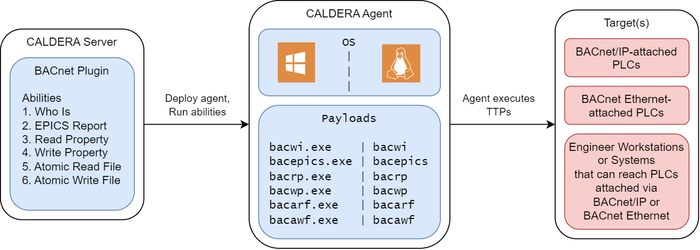

# BACnet

BACnet (Building and Control Network) Protocol Threat Emulation Tooling

## Overview
The BACnet plugin provides adversary emulation abilities specific to the BACnet protocol. The BACnet standard, ANSI/ASHRAE 135, for the BACnet protocol is available for purchase from ASHRAE as described on the [BACnet Committee](https://bacnet.org/buy/) website.

The following table outlines MITRE ATT&CK for ICS Tactic coverage provided by the BACnet plugin:

| Discovery               | Collection                 | Impact                  |
| :---------------------- | :------------------------- | :---------------------- |
| Remote System Discovery | Automated Collection       | Manipulation of Control |
|                         | Monitor Process State      |                         |
|                         | Point & Tag Identification |                         |

### Compatibility
The plugin's payloads currently support deployment to Caldera Agents of the following computer architectures:
|        | Windows | Linux | Macintosh |
| -----: | :-----: | :---: | :-------: |
| 32-bit |         |       |           |
| 64-bit | **X**   | **X** |           |

* The linux payload was compiled on Ubuntu 22.04.2 LTS with GNU Make 4.4.
* The windows payload was compiled on Windows 10 v21H2 with GNU Make 4.4.1 (part of Mingw64 tools downloaded through MSYS2).

### Ability Overview Tables
The following tables list each plugin ability by their corresponding tactic. A heatmap of plugin abilities is available to view [here](assets/ics-coverage-map.png).

#### **Discovery Abilities**
| Name 	                | Tactic 	        | Technique |  Technique ID     |
|---------              |---------	        |---------	|---------	        |
| [BACnet Who-Is](#who-is)   | Discovery   | Remote System Discovery |  T0846    |

#### **Collection Abilities**
| Name 	                | Tactic 	        | Technique |  Technique ID     |
|---------              |---------	        |---------	|---------	        |
| [BACnet Atomic Read File](#atomic-read-file) | Collection | Monitor Process State |  T0801    |
| [BACnet EPICS Report](#epics-report) | Collection | Automated Collection |  T0802    |
| [BACnet Read Property](#read-property) | Collection | Point & Tag Identification |  T0861    |

#### **Impact Abilities**
| Name 	                | Tactic 	        | Technique |  Technique ID     |
|---------              |---------	        |---------	|---------	        |
| [BACnet Atomic Write File](#atomic-write-file) | Impact   | Manipulation of Control  |  T0831    |
| [BACnet Write Property](#write-property)   | Impact    | Manipulation of Control  |  T0831    |

## Architecture
This section describes the main components of the plugin and how they interface.

### Block Diagram

The BACnet Plugin introduces several new abilities to the user once installed on the Caldera server. The abilities execute on the agent and can target any device that supports the BACnet protocol via IP or Ethernet.

Compatible targets include, but are not limited to: BACnet/IP-attached PLCs, BACnet Ethernet-attached PLCs, and Engineering Workstations or Systems that can reach PLCs attached via BACnet/IP or BACnet Ethernet.

### Payloads

The BACnet plugin leverages several payloads that are part of the BACnet Stack detailed in the [libraries](#libraries) section. There is 1 additional payload used for EPICS report generation.

Payload:
* `bacarf`: &emsp; The **read file** protocol service, part of the BACnet Stack
* `bacawf`: &emsp; The **write file** protocol service, part of the BACnet Stack
* `bacrp`: &emsp; The **read property** protocol service, part of the BACnet Stack
* `bacwi`: &emsp; The **who is** protocol service, part of the BACnet Stack
* `bacwp`: &emsp; The **write property** protocol service, part of the BACnet Stack
* `bacepics`: &emsp; An application to generate **EPICS reports**

### Libraries
The following libraries were used to build the BACnet payloads:

| Library | Version	 | License |
|---------|--------- |---------|
|bacnet-stack |[1.0](https://github.com/bacnet-stack/bacnet-stack/tree/bacnet-stack-1.0) |[GPL](https://github.com/bacnet-stack/bacnet-stack/tree/master/license)      |

## Usage
This section describes how to initially deploy and execute the abilities present within the BACnet plugin.

### Deployment
1. Identify systems likely to be on the same network / subnet as BACnet devices.
2. Utilize Lateral Movement or other means to get a Caldera agent deployed onto one or more of these systems.
3. Run the ability **BACnet Who-Is** against a system to scan for BACnet devices accessible to that system.
4. Run any of the other BACnet abilities in order to locate objects/properties, identify program state, or to impact control.

*Reference the Caldera training plugin for a step-by-step tutorial on how to deploy an agent and run abilities via a campaign.*

#### BACnet Sources and Facts

The following Facts are used by BACnet plugin abilities:

Key:
- [-] = Ability does not use this fact
- [**X**] = Ability uses this fact

| Fact Name/Ability Used By | Who-Is	    | EPICS     |  Read Property  | Read File | Write Property | Write File |
|---------              |---------	      |---------	|---------	      |---------  |---------       |---------   |
| bacnet.device.instance   | [-]             | [**X**]   | [**X**]         | [**X**]   | [**X**]        | [**X**]    |
| bacnet.obj.type       | [-]             | [-]       | [**X**]         | [-]       | [**X**]        | [-]        |
| bacnet.obj.instance   | [-]             | [-]       | [**X**]         | [-]       | [**X**]        | [-]        |
| bacnet.obj.property   | [-]             | [-]       | [**X**]         | [-]       | [**X**]        | [-]        |
| bacnet.read.index     | [-]             | [-]       | [**X**]         | [-]       | [-]            | [-]        |
| bacnet.file.instance  | [-]             | [-]       | [-]             | [**X**]   | [-]            | [**X**]    |
| bacnet.read.local_name| [-]             | [-]       | [-]             | [**X**]   | [-]            | [-]        |
| bacnet.write.priority | [-]             | [-]       | [-]             | [-]       | [**X**]        | [-]        |
| bacnet.write.index    | [-]             | [-]       | [-]             | [-]       | [**X**]        | [-]        |
| bacnet.write.tag      | [-]             | [-]       | [-]             | [-]       | [**X**]        | [-]        |
| bacnet.write.value    | [-]             | [-]       | [-]             | [-]       | [**X**]        | [-]        |
| bacnet.write.local_name   | [-]             | [-]       | [-]             | [-]       | [-]            | [**X**]    |
| bacnet.write.octet_offset | [-]             | [-]       | [-]             | [-]       | [-]            | [**X**]    |

####  Sample Facts - BACnet
    ...
    name: BACnet Sample Facts
    facts:
    - trait: bacnet.device.instance
      value: 100101
    - trait: bacnet.device.instance
      value: 200101
    ...

Read more about [facts](https://caldera.readthedocs.io/en/latest/Basic-Usage.html?highlight=fact#facts) in the Caldera documentation

#### Additional Resources:
Here is a small selection of resources to aid in understanding of the BACnet protocol. You may already have more specific specification documents, vendor manuals, and other resources to assist with understanding the state of your target environment.

* ["ASHRAE Technical FAQ 51: What is BACnet?" (ASHRAE)](https://www.ashrae.org/technical-resources/technical-faqs/question-51-what-is-bacnet)

* ["The Language of BACnet-Objects, Properties, and Services" (BACnet Committee)](https://bacnet.org/wp-content/uploads/sites/4/2022/06/The-Language-of-BACnet-1.pdf)

A few additional references are also linked to in the [Abilities](#abilities) overview below.

### Abilities

#### Who-Is
    The Who-Is service is used by a sending BACnet-user to determine the Device object identifier, the network address, or both, of other BACnet devices that share the same internetwork.

    Usage:
      ./bacwi

#### EPICS Report
    Generates an EPICS report - which provides services supported, the object list, and properties of those objects.

    Usage:
      ./bacepics <device-instance>

    Arguments:
      device-instance    Instance number of the device (can also be IP:Port of the device instead)

    Example:
      ./bacepics 100101

#### Read Property
    The ReadProperty service is used by a client BACnet-user to request the value of one property of one BACnet Object.

    Usage:
      ./bacrp <device-instance> <object-type> <object-instance> <property> <index>

    Arguments:
      device-instance    Instance number of the device (can also be IP:Port of the device instead)
      object-type        The type of object to be read (bacenum.h > BACNET_OBJECT_TYPE)
                          e.g., object-type (8): Device
      object-instance    The instance number of the object-type specified (this is specific to the device)
      property           The property of the object to be read (bacenum.h > BACNET_PROPERTY_ID)
                          e.g., property (76): Object List
      index
          -2: An improved -1 for arrays. Iteratively reads each index of the array-type property to avoid seg issue
          -1: Reads the whole property (this can fail for arrays if the device doesn't support segmentation)
           0: Gets the length of the property if it is an array type
        1..N: Gets the property value at index N if it is an array type

    Example:
      ./bacrp 100101 8 100101 76 -2

  [Reference: bacenum.h](https://github.com/bacnet-stack/bacnet-stack/blob/master/src/bacnet/bacenum.h)

#### Write Property
    The WriteProperty service is used by a client BACnet-user to modify the value of a single specified property of a BACnet object.

    Usage:
      ./bacwp <device-instance> <object-type> <object-instance> <property> <priority> <index> <tag> <value>

    Arguments:
      device-instance    The instance number of the device (can also be IP:Port of the device instead)
      object-type        The type of object to be written to (bacenum.h > BACNET_OBJECT_TYPE)
                          e.g. object-type (4): Binary Output
      object-instance    The instance number of the object-type specified (this is specific to the device)
      property           The property of the object to be written to (bacenum.h > BACNET_PROPERTY_ID)
                          e.g., property (85): Present Value
      priority           The precedence of the write (lower is higher) (search BACnet Priority Array for more info)
      index
          -1: Write the whole property specified
        1..N: Write the value at index N for an array type property
      tag                The type of value to be written (bacenum.h > BACNET_APPLICATION_TAG)
                          e.g., tag (9): Type 'Enumerated'
      value              The write value itself
                          e.g., value (0): Off/Low

    Example:
      ./bacwp 100101 4 7 85 5 -1 9 0

  [BACnet Priority Array Help Resource](http://www.bacnetwiki.com/wiki/index.php?title=Priority_Array)

#### Atomic Read File
    The AtomicReadFile Service is used by a client BACnet-user to perform an open-read-close operation on the contents of the specified file. The file is saved locally.

    Usage:
      ./bacarf <device-instance> <file-instance> <local-file-name>

    Arguments:
      device-instance    The instance number of the BACnet device
      file-instance      Specifies which file on the device to read
      local-file-name    The name of the local file in which to store the read data

    Example:
      ./bacarf 100101 3 file_dump

#### Atomic Write File
    The AtomicWriteFile Service is used by a client BACnet-user to perform an open-write-close operation of an OCTET STRING into a specified position or a list of OCTET STRINGs into a specified group of records in a file.

    Usage:
      ./bacawf <device-instance> <file-instance> <local-file-name> <octet-offset>

    Arguments:
      device-instance    The instance number of the BACnet device
      file-instance      Specifies which file on the device to write to
      local-file-name    The name of the local file containing content that will be written to the BACnet device file
      octet-offset       The byte offset in the BACnet device file at which the content will be written to

    Example:
      ./bacawf 100101 5 ieee_754_payload 31

## Source Code
The binaries for this plugin are produced by compiling [BACnet Stack](https://github.com/bacnet-stack/bacnet-stack/tree/bacnet-stack-1.0) 1.0. The functionality of readprop and writeprop were modified - the modified variants can be found inside this plugin's [src directory](/src/).

## Copyright Notice

ASHRAE® and BACnet® are registered trademarks of the American Society of Heating, Refrigerating and Air-Conditioning Engineers, Inc. 180 Technology Parkway NW, Peachtree Corners, Georgia 30092 US.

This Caldera plugin is named "BACnet" as that is a short identifier of its purpose / scope. This plugin is not produced-by ASHRAE.