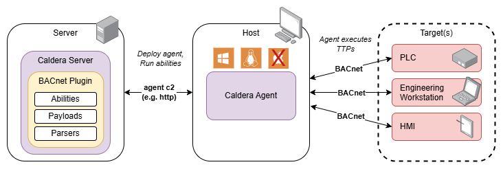

# BACnet

BACnet (Building and Control Network) Protocol Threat Emulation Tooling

Mapped to MITRE ATT&CK® for ICS [v16](https://attack.mitre.org/resources/updates/updates-october-2024/)

## Overview
The BACnet plugin provides **14** adversary emulation abilities specific to the
BACnet protocol. The BACnet standard, ANSI/ASHRAE 135, for the BACnet protocol
is available for purchase from ASHRAE as described on the 
[BACnet Committee](https://bacnet.org/buy/) website.

The following table outlines MITRE ATT&CK for ICS Tactic coverage provided by the BACnet plugin:

|[Discovery](#discovery-abilities)|[Collection](#collection-abilities)|[Impact](#impact-abilities)|[Inhibit Response Function](#inhibit-response-function-abilities)|
|:--------------------------------|:----------------------------------|:--------------------------|:----------------------------------------------------------------|
| Remote System Discovery             | Automated Collection       | Manipulation of Control | Device Restart/Shutdown   |  
| Remote System Information Discovery | Monitor Process State      |                         |                           |
|                                     | Point & Tag Identification |                         |                           |

### Ability Overview Tables
The following tables list each plugin ability by their corresponding tactic. A heatmap of plugin abilities is available to view [here](assets/bacnet-heatmap.png).

#### Discovery Abilities
| Name  | Tactic | Technique |  Technique ID |
|:------|:-------|:----------|:--------------|
| [BACnet Who-Is](#who-is)   | Discovery   | Remote System Discovery |  T0846    |
| [BACnet Who-Has](#who-has) | Discovery | Remote System Information Discovery | T0888 |


#### Collection Abilities
| Name  | Tactic | Technique |  Technique ID |
|:------|:-------|:----------|:--------------|
| [BACnet Atomic Read File](#atomic-read-file) | Collection | Monitor Process State |  T0801    |
| [BACnet EPICS Report](#epics-report) | Collection | Automated Collection |  T0802    |
| [BACnet Get Event Information](#get-event-information) | Collection | Monitor Process State |  T0801    |
| [BACnet Read Property](#read-property) | Collection | Point & Tag Identification |  T0861    |
| [BACnet Read Property Multiple](#read-property-multiple) | Collection | Point & Tag Identification |  T0861    |
| [BACnet Device Collection - Basic](#read-property-multiple) | Collection | Point & Tag Identification |  T0861    |
| [BACnet Object Collection - Basic](#read-property-multiple) | Collection | Point & Tag Identification |  T0861    |
| [BACnet Subscribe COV](#subscribe-cov) | Collection | Automated Collection |  T0802    |


#### Impact Abilities
| Name  | Tactic | Technique |  Technique ID |
|:------|:-------|:----------|:--------------|
| [BACnet Atomic Write File](#atomic-write-file) | Impact   | Manipulation of Control  |  T0831    |
| [BACnet Write Property](#write-property)   | Impact    | Manipulation of Control  |  T0831    |

#### Inhibit Response Function Abilities
| Name  | Tactic | Technique |  Technique ID |
|:------|:-------|:----------|:--------------|
| [BACnet Reinitialize Device - Warm Start](#reinitialize-device) | Inhibit Response Function | Device Restart/Shutdown | T0816 |
| [BACnet Reinitialize Device - Cold Start](#reinitialize-device) | Inhibit Response Function | Device Restart/Shutdown | T0816 |

## Architecture
This section describes the main components of the plugin and how they interface.

### Block Diagram


The BACnet Plugin exposes several new protocol specific abilities to your Caldera instance. The abilities are executed from a host running a Caldera agent via the corresponding payload. Abilities must target devices that support the BACnet protocol to achieve the described effects.

### Payloads

The BACnet plugin leverages several payloads that are part of the BACnet Stack detailed in the [libraries](#libraries) section. Each payload is an individual BACnet service, with a name combining `bac` + `service_name`. The payloads have been compiled for 2 different architectures.

Example payloads for BACnet Read Property service:
* `bacrp.exe` - Windows executable **Read Property** protocol service
* `bacrp` - Linux executable for the **Read Property** protocol service

#### Compatibility
The plugin's payloads currently support deployment to Caldera Agents of the following computer architectures:

|        | Windows | Linux | Macintosh |
| -----: | :-----: | :---: | :-------: |
| 32-bit |         |       |           |
| 64-bit | **X**   | **X** |           |

* The Linux payload was compiled on Ubuntu 22.04.2 LTS with GNU Make 4.4.
* The Windows payload was compiled on Windows 10 v21H2 with GNU Make 4.4.1 (part of Mingw64 tools downloaded through MSYS2).


### Libraries
The following libraries were used to build the BACnet payloads:

| Library | Version	 | License |
|---------|--------- |---------|
|bacnet-stack |[1.0](https://github.com/bacnet-stack/bacnet-stack/tree/bacnet-stack-1.0) |[GPL](https://github.com/bacnet-stack/bacnet-stack/tree/master/license)      |

## Usage
This section describes how to initially deploy and execute the abilities present within the BACnet plugin.

### Deployment
1. Identify the target system you would like to communicate with via the BACnet protocol.
2. Identify a viable host for the Caldera agent that will be sending BACnet
   messages to the target system. A viable host will have a network connect to the target
   system and have be [compatible](#compatibility) with the payloads in this plugin.
3. Deploy the Caldera agent to the viable host.
4. Run a combination of the BACnet plugin abilities to achieve the desired effect. 

_If you don't know where to begin, try using [Who-Is](#who-is) to discover BACnet devices on the network._

```{tip}
Reference the Caldera training plugin for a step-by-step tutorial on how to deploy an agent and run abilities via an operation.
```

### Abilities

#### Who-Is
The Who-Is service is used by a sending BACnet-user to determine the Device
object identifier, the network address, or both, of other BACnet devices that
share the same internetwork.

__Ability Command:__
```caldera
./bacwi
```

#### Who-Has
The Who-Has service is used by a sending BACnet-user to determine the Device
object identifier, the network address, or both, of BACnet devices that contain
a given object name or object identifier.


If a device in the instance range has that object, an "I-Have" response will be
reported, stating the object-type and object-instance

__Ability Command:__
```caldera
./bacwh #{bacnet.device.min_instance} #{bacnet.device.max_instance} #{bacnet.obj.name}
```
__Facts:__  
| Name | Description | Type |
|:-----|:------------|:----:|
| `bacnet.device.min_instance` | Minimum device instance to check | int |
| `bacnet.device.max_instance` | Maximum device instance to check | int |
| `bacnet.obj.name` | object-name, object-type, or object-instance to check for | string |


__Examples:__  
```sh
./bacwh 100200 100300 "Timer"
````
```sh
./bacwh 100200 100300 binary-value 7
```

#### EPICS Report
Generates an EPICS report - which provides services supported, the object list,
and properties of those objects.

__Ability Command:__
```caldera
./bacepics #{bacnet.device.instance}
```

__Facts:__  
| Name | Description | Type |
|:-----|:------------|:----:|
| `bacnet.device.instance` | Device instance to poll (also accepts IP:Port address of device) | int |

__Examples:__  
```sh
./bacepics 100101
```

#### Get Event Information
The GetEventInformation service is used by a client BACnet-user to get a summary
of all active state events on the target device.

__Ability Command:__
```caldera
./bacge #{bacnet.device.instance}
```

__Facts:__  
| Name | Description | Type |
|:-----|:------------|:----:|
| `bacnet.device.instance` | Device instance to poll (also accepts IP:Port address of device) | int |

__Examples:__  
```sh
./bacge 100101
```

#### Read Property
The ReadProperty service is used by a client BACnet-user to request the value of
one property of one BACnet Object.

__Ability Command:__
```caldera
./bacrp #{bacnet.device.instance} #{bacnet.obj.type} #{bacnet.obj.instance} #{bacnet.obj.property} #{bacnet.read.index}
```

__Facts:__  
| Name | Description | Type |
|:-----|:------------|:----:|
| `bacnet.device.instance` | Device instance (also accepts IP:Port address of device) | int |
| `bacnet.obj.type` | Type of the [object](#objects) to be read | int |
| `bacnet.obj.instance` | The [instance number](#objects) of the object-type specified | int |
| `bacnet.obj.property` | The [property](#properties) of the object to be read | int |
| `bacnet.read.index` | How to handle reading arrays | int |

Read Index Values:
- `-2`: An improved -1 for arrays. Iteratively reads each index of the array-type property
- `-1`: Reads the whole property (this can fail for arrays if the device doesn't support segmentation)
- `0`: Gets the length of the property if it is an array type
- `1..N`: Gets the property value at index N if it is an array type

__Examples:__  
```sh
./bacrp 100101 8 100101 76 -2
```

#### Read Property Multiple
The ReadPropertyMultiple service is used by a client BACnet-user to request the
values of one or more specified properties of one ore more BACnet Objects. For
example, a single property for a single object, a list of properties for a
single object, or even any number of properties for any number of objects.

Read Property Multiple is similar to Read Property, but allows multiple
properties to be provided, in the form of a comma separate list (e.g., "1,2,3").

__Ability Command:__
```caldera
./bacrpm #{bacnet.device.instance} #{bacnet.obj.type} #{bacnet.obj.instance} #{bacnet.obj.property}
```

__Facts:__  
| Name | Description | Type |
|:-----|:------------|:----:|
| `bacnet.device.instance` | Device instance (also accepts IP:Port address of device) | int |
| `bacnet.obj.type` | Type of the [object](#objects) to be read | int |
| `bacnet.obj.instance` | The [instance number](#objects) of the object-type specified | int |
| `bacnet.obj.property` | The [properties](#properties) of the object to be read | comma separated list of int |

__Examples:__  
```sh
./bacrpm 100101 8 100101 77,28
```

BACnet Device Collection Example:

Read the Object Name (77), Vendor Name (121), Model Name (70), Description (28),
and Object List (76), of the Device Object 100101.
```sh
./bacrpm 100101 device 100101 77,121,70,28,76
```

#### Subscribe COV
The SubscribeCOV service is used by a client to subscribe to 
Change Of Value (COV) notifications for the properties of a
given object.

__Ability Command:__
```caldera
./bacscov #{bacnet.device.instance} #{bacnet.obj.type} #{bacnet.obj.instance} #{bacnet.scov.process_id}  #{bacnet.scov.confirm_status}
```

__Facts:__  
| Name | Description | Type |
|:-----|:------------|:----:|
| `bacnet.device.instance` | Device instance  (also accepts IP:Port address of device) | int |
| `bacnet.obj.type` | Type of the [object](#objects) to subscribe to | int |
| `bacnet.obj.instance` | The [instance number](#objects) of the object-type specified | int |
| `bacnet.scov.process_id` | A process identifier for the COV subscription | int |
| `bacnet.scov.confirm_status` | A flag to subscribe with confirmed notifications | "confirmed" or "unconfirmed" |

__Examples:__  
```sh
./bacscov 100101 binary-output 13 1234 unconfirmed
```

#### Write Property
The WriteProperty service is used by a client BACnet-user to modify the value of
a single specified property of a BACnet object.

__Ability Command:__
```caldera
./bacwp #{bacnet.device.instance} #{bacnet.obj.type} #{bacnet.obj.instance} #{bacnet.obj.property} #{bacnet.write.priority} #{bacnet.write.index} #{bacnet.write.tag} #{bacnet.write.value}
```

__Facts:__  
| Name | Description | Type |
|:-----|:------------|:----:|
| `bacnet.device.instance` | Device instance (also accepts IP:Port address of device) | int |
| `bacnet.obj.type` | Type of the [object](#objects) to be written to | int |
| `bacnet.obj.instance` | The [instance number](#objects) of the object-type specified | int |
| `bacnet.obj.property` | The [property](#properties) of the object to be written to | int |
| `bacnet.write.priority` | The precedence of the write (lower is higher) | int |
| `bacnet.write.index` | `-1` write the entire property, `1..N` write to the specified index | int |
| `bacnet.write.tag` | The [type of value](#bacnet-numeric-codes) to be written | int |
| `bacnet.write.value` | The write value itself | int |

__Examples:__  
```sh
./bacwp 100101 4 7 85 5 -1 9 0
```

#### Atomic Read File
The AtomicReadFile Service is used by a client BACnet-user to perform an
open-read-close operation on the contents of the specified file. The file is
saved locally.

__Ability Command:__
```caldera
./bacarf #{bacnet.device.instance} #{bacnet.file.instance} #{bacnet.read.local_name}
```

__Facts:__  
| Name | Description | Type |
|:-----|:------------|:----:|
| `bacnet.device.instance` | Device instance (also accepts IP:Port address of device) | int |
| `bacnet.file.instance` | Specifies which file on the device to read | int |
| `bacnet.read.local_name` | The name of the local file in which to store the read data | string |

__Examples:__  
```sh
./bacarf 100101 3 file_dump
```

#### Atomic Write File
The AtomicWriteFile Service is used by a client BACnet-user to perform an
open-write-close operation of an OCTET STRING into a specified position or a
list of OCTET STRINGs into a specified group of records in a file.

__Ability Command:__
```caldera
./bacawf #{bacnet.device.instance} #{bacnet.file.instance} #{bacnet.write.local_name} #{bacnet.write.octet_offset}
```

__Facts:__  
| Name | Description | Type |
|:-----|:------------|:----:|
| `bacnet.device.instance` | Device instance (also accepts IP:Port address of device) | int |
| `bacnet.file.instance` | Specifies which file on the device to write to | int |
| `bacnet.write.local_name` | The name of the local file containing content that will be written to the BACnet device file | string |
| `bacnet.write.octal_offset` | The byte offset in the BACnet device file at which the content will be written to | int |

__Examples:__  
```sh
./bacawf 100101 5 ieee_754_payload 31
```

#### Reinitialize Device
The ReinitializeDevice service is used by a client BACnet-user to instruct a
remote device to do one of the following behaviors: reboot (cold start), reset
to another predefined initial state (warm start), activate network port object
changes, or to control the backup or restore procedures.

__Ability Command:__
```caldera
 ./bacrd #{bacnet.device.instance} 1
 ```
__Facts:__  
| Name | Description | Type |
|:-----|:------------|:----:|
| `bacnet.device.instance` | Device instance (also accepts IP:Port address of device) | int |

__Examples:__  
```sh
./bacrd 100101 1
```

## Protocol Details

BACnet models a device as a collection of **objects**. Each object represents
something on the device: a sensor, an output, a schedule, the device itself, etc.

### Objects

An object is identified by its **object type** plus an **object instance**:

- **Object type**: the kind of thing it is  
  Examples: `analog-input`, `analog-output`, `binary-input`, `device`, `schedule`, etc.  
  In the BACnet specification (and this plugin), these types are represented as 
  [numeric codes](#bacnet-numeric-codes).

- **Object instance**: which one of that type it is  
  Each object type on a device has instance numbers (0, 1, 2, …) that uniquely
  identify individual objects of that type on that device.

Together, `(object type, object instance)` uniquely identify an object within a device.

### Properties

Each object has **properties**, which are named pieces of data that describe the
object or its current state. For example:

- `object-identifier` – the object’s type and instance
- `object-name` – a human-readable label
- `present-value` – the current value (e.g., temperature, setpoint)
- `units` – engineering units (e.g., degrees Celsius)
- `status-flags` – alarm/fault/overridden indicators

Like object types, property names are also represented as [numeric codes](#bacnet-numeric-codes).

Some property values are stored as arrays. In these cases, the `#{bacnet.read.index}` or `#{bacnet.write.index}`
facts are used to identify the **index** in that array to read or write.

### BACnet Numeric Codes

As described above, BACnet object types and properties are defined by numeric
codes in the BACnet specification. This plugin relies on those same codes to be
supplied to abilities (via facts) to specify the desired action. You can find
the full list of codes and their corresponding names in the BACnet stack source
code:

- `#{bacnet.obj.type} facts: [Object Types](https://github.com/bacnet-stack/bacnet-stack/blob/cfb82a937fe64b9c7d8eae1f7e723879bb4c9305/src/bacnet/bacenum.h#L1179)
- `#{bacnet.obj.property} facts: [Object Properties](https://github.com/bacnet-stack/bacnet-stack/blob/cfb82a937fe64b9c7d8eae1f7e723879bb4c9305/src/bacnet/bacenum.h#L27)
- `#{bacnet.write.tag} facts: [Application Tags](https://github.com/bacnet-stack/bacnet-stack/blob/cfb82a937fe64b9c7d8eae1f7e723879bb4c9305/src/bacnet/bacenum.h#L1291)


### Additional Resources:
Here is a small selection of resources to aid in understanding of the BACnet
protocol. You may already have more specific specification documents, vendor
manuals, and other resources to assist with understanding the state of your
target environment.

* ["ASHRAE Technical FAQ 51: What is BACnet?" (ASHRAE)](https://www.ashrae.org/technical-resources/technical-faqs/question-51-what-is-bacnet)
* ["The Language of BACnet-Objects, Properties, and Services" (BACnet Committee)](https://bacnet.org/wp-content/uploads/sites/4/2022/06/The-Language-of-BACnet-1.pdf)

## Source Code

The binaries for this plugin are produced by compiling 
[BACnet Stack 1.0](https://github.com/bacnet-stack/bacnet-stack/tree/bacnet-stack-1.0).
The functionality of readprop and writeprop have been modified by the Caldera
for OT team. The source code for these binaries can can be found inside this
plugin's `src/` directory.


## Copyright Notice

ASHRAE® and BACnet® are registered trademarks of the American Society of Heating, Refrigerating and Air-Conditioning Engineers, Inc. 180 Technology Parkway NW, Peachtree Corners, Georgia 30092 US.

This Caldera plugin is named "BACnet" as that is a short identifier of its purpose / scope. This plugin is not produced-by ASHRAE.
